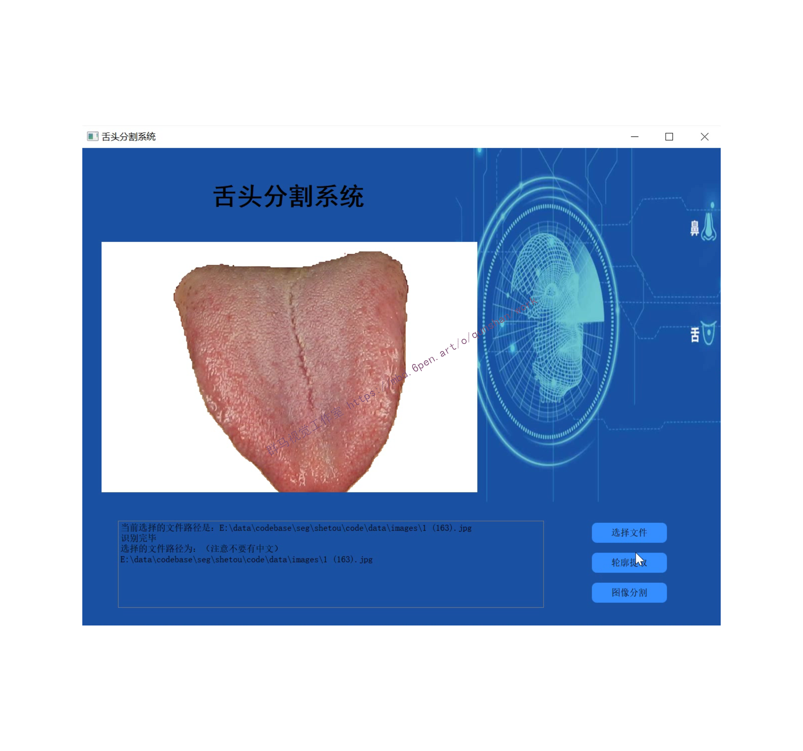
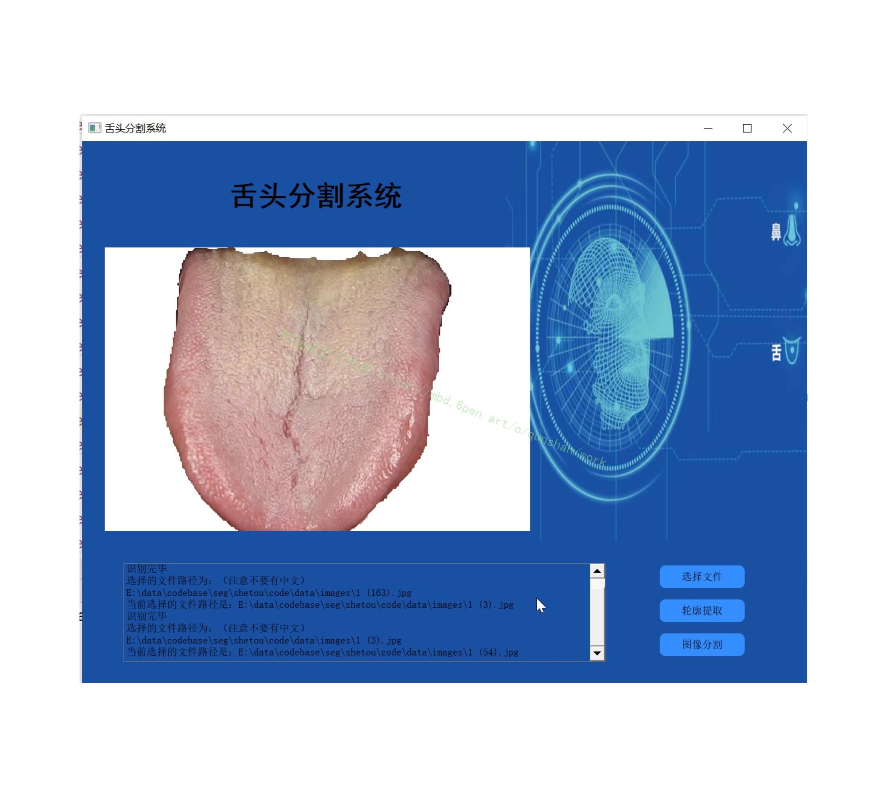
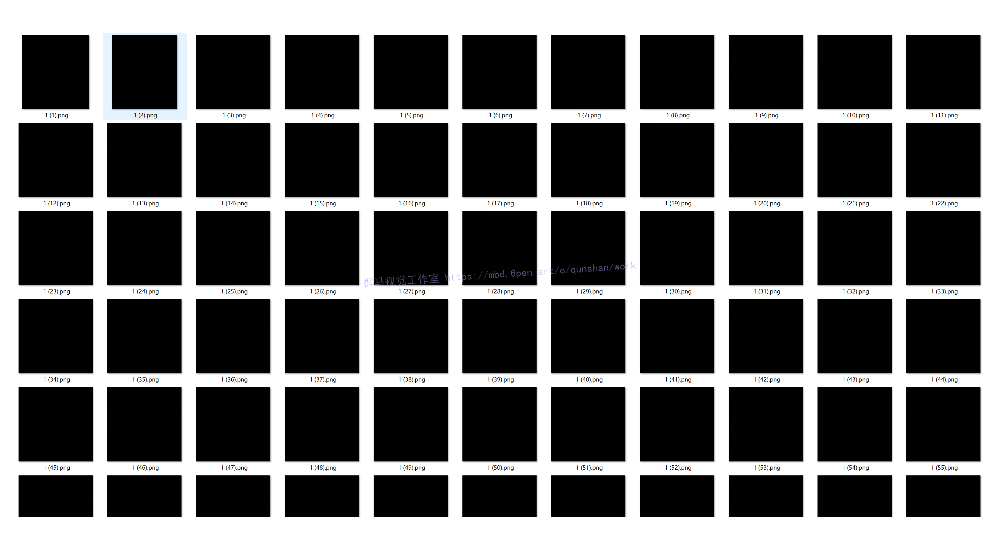
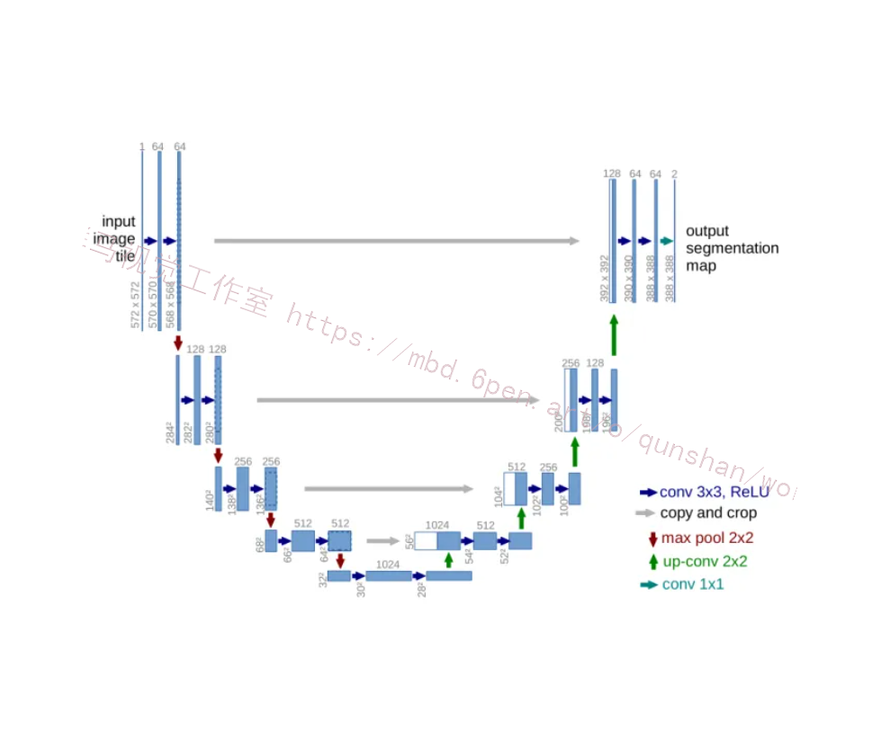
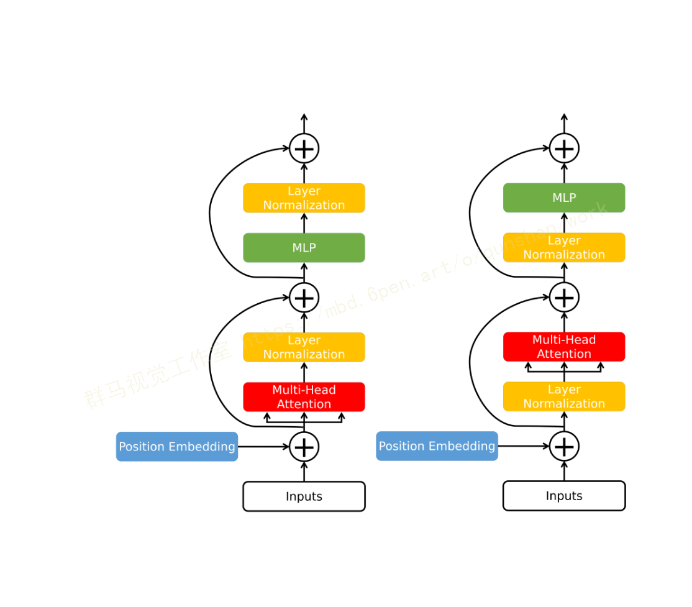

# 1.研究背景
随着人工智能技术发展的日益成熟，无论在人们的生活还是学习中，都有人工智能的影子。在科技发展的过程中，硬件方面的提升非常迅速。近几年，深度学习在硬件的提升下，开始迈向了新的步伐。图像分割是人工智能的一个方向，分类结果的精确度直接受分割结果影响，所以分割起到至关重要的作用。　　中医对舌苔诊断依据是“望诊”，这是传统的手段。随着现代化技术的发展，对中医而言智能化和客观化是必不可少的方式，现代的智能化技术对中医辅助帮助很大，深度学习在中医领域可以进行辅助诊断和效果的提升，也对中医的发展具有推动作用。

# 2.图片演示




# 3.视频演示

[改进Unet的舌头分割系统（源码＆教程）_哔哩哔哩_bilibili](https://www.bilibili.com/video/BV158411s75h/?vd_source=bc9aec86d164b67a7004b996143742dc)


# 4.舌苔分割数据集


#### 数据加载
这一步，可以做很多事情，说白了，无非就是图片怎么加载，标签怎么定义，为了增加算法的鲁棒性或者增加数据集，可以做一些数据增强的操作。

既然是处理数据，那么我们先看下数据都是什么样的，再决定怎么处理。



Pytorch 给我们提供了一个方法，方便我们加载数据，我们可以使用这个框架，去加载我们的数据。看下伪代码：
```
# ================================================================== #
#                Input pipeline for custom dataset                 #
# ================================================================== #

# You should build your custom dataset as below.
class CustomDataset(torch.utils.data.Dataset):
    def __init__(self):
        # TODO
        # 1. Initialize file paths or a list of file names. 
        pass
    def __getitem__(self, index):
        # TODO
        # 1. Read one data from file (e.g. using numpy.fromfile, PIL.Image.open).
        # 2. Preprocess the data (e.g. torchvision.Transform).
        # 3. Return a data pair (e.g. image and label).
        pass
    def __len__(self):
        # You should change 0 to the total size of your dataset.
        return 0 

# You can then use the prebuilt data loader. 
custom_dataset = CustomDataset()
train_loader = torch.utils.data.DataLoader(dataset=custom_dataset,
                                           batch_size=64, 
                                           shuffle=True)
```


# 5.Unet算法
U-Net算法是一种适合医学影像分割的网络模型。医学领域进行视觉分割的一大难题是数据比较少，而U-Net模型，可以相对较少的数据，准确预测肿瘤存在的位置。它是比较早期的全卷积网络语义分割的算法，使用[包含压缩路径和扩展路径的对称U形结构](https://mbd.pub/o/bread/Y5qWl5lt)，当然也可以应用再其他得数据收集困难得场景中。


# 6.Unet算法改进

[该文献提出了Transformer-UNet](https://afdian.net/item?plan_id=0176e39858dd11edace852540025c377)，通过在原始图像中添加Transformer Block而不是在UNet中添加Feature map

首先设计一个典型的UNet作为CNN结构，使用双线性插值作为上采样方法，max-pooling作为下采样方法。为了方便实现，作者设计了一个几乎对称的网络，它可以很容易修改注意力模块和Transformer模块。然而，在T-Unet中，编码器和解码器并不直接连接，这将在本节中解释。

Transformer作为一个以序列数据为输入的模型，对于分割任务Transformer则需要1D数据。因此，需要将一幅 原始图像平展成 维的数组，其中n×n为图像patch的大小， 为数组序列的长度。遵循Dosovitskiy等人所提的方法，将整个图像分割成不同的平方块，n是正方形边缘的长度。为了简化实现过程，在大多数情况下假设H=W和H，W可以被n整除。



与NLP Transformer略有不同，如图1所示。ViT将LayerNorm放在Multi-Head Attention和MLP之前，以确保输入值不会太大而无法处理。此外，ViT保留了Vaswani等人(2017)的主要设计，如Multi-Head Self-Attention和MLP层。Dosovitskiy等人(2021)进一步添加了一个可学习的数组tensor，用于在将整个序列输入到存储在T-Unet中的Transformer之前进行位置嵌入。
进一步修改ViT，用ELU代替GELU作为在 Transformer MLP层的激活函数，因为作者观察到ELU在实验中表现更好。与RELU和GELU相比，ELU在Transformer中使用较少，其定义为:
本文认为ELU是有用的，因为CT图像中的负值与正值同样重要。在实验中将超参数α设为1。
MHA为Multi-Head Attention layers, LN为layer normalization, 为image patches, 为Transformer layer number。对于原始图像的处理，在ViT中通过在整个图像上应用一个核大小为 的卷积操作进行Position Embedding过程。
Transformer在提取局部特征方面不如CNN高效，所以作者遵循UNet的设计在T-Unet中添加了一个附加的编码器。此编码器不直接与解码器连接。
相反，它输出具有不同接受域的特征映射，并将它们与解码器中的特征映射连接起来，如图2所示。解码器以Transformer的输出作为输入，具体来说，对于采用大小为 的序列的Transformer，将其输出Reshape为大小为 并将其直接送入解码器。通过这样做保证了解码器的输入包含了不同图像patch的信息，因此对最终预测更好。
由于在TUnet中处理原始图像，原始图像和图像patch的大小非常重要，因为它们决定了Transformer模型的大小和运行速度。由于选择CT82作为实验数据集，其中包含大小为 的高分辨率CT切片，因此选择 作为图像patch大小，因此构建的序列长度为1024。因此，在实验中解码器的输入尺寸为 ，进一步通过双线性插值将其Reshape为尺寸为 。作者按照Ronneberger等人的方法在解码器中添加了连接部分，并相应地构建了编码器。为了最小化模型，同时保持其效率，作者设计的Transformer模块中的注意力头和总层数分别为8和6。

# 7.代码实现
```
#    Copyright 2020 Division of Medical Image Computing, German Cancer Research Center (DKFZ), Heidelberg, Germany
#
#    Licensed under the Apache License, Version 2.0 (the "License");
#    you may not use this file except in compliance with the License.
#    You may obtain a copy of the License at
#
#        http://www.apache.org/licenses/LICENSE-2.0
#
#    Unless required by applicable law or agreed to in writing, software
#    distributed under the License is distributed on an "AS IS" BASIS,
#    WITHOUT WARRANTIES OR CONDITIONS OF ANY KIND, either express or implied.
#    See the License for the specific language governing permissions and
#    limitations under the License.


import numpy as np
import torch
from nnunet.network_architecture.custom_modules.conv_blocks import BasicResidualBlock, ResidualLayer
from nnunet.network_architecture.generic_UNet import Upsample
from nnunet.network_architecture.generic_modular_UNet import PlainConvUNetDecoder, get_default_network_config
from nnunet.network_architecture.neural_network import SegmentationNetwork
from nnunet.training.loss_functions.dice_loss import DC_and_CE_loss
from torch import nn
from torch.optim import SGD
from torch.backends import cudnn


class ResidualUNetEncoder(nn.Module):
    def __init__(self, input_channels, base_num_features, num_blocks_per_stage, feat_map_mul_on_downscale,
                 pool_op_kernel_sizes, conv_kernel_sizes, props, default_return_skips=True,
                 max_num_features=480, block=BasicResidualBlock):
        """
        Following UNet building blocks can be added by utilizing the properties this class exposes (TODO)

        this one includes the bottleneck layer!

        :param input_channels:
        :param base_num_features:
        :param num_blocks_per_stage:
        :param feat_map_mul_on_downscale:
        :param pool_op_kernel_sizes:
        :param conv_kernel_sizes:
        :param props:
        """
        super(ResidualUNetEncoder, self).__init__()

        self.default_return_skips = default_return_skips
        self.props = props

        self.stages = []
        self.stage_output_features = []
        self.stage_pool_kernel_size = []
        self.stage_conv_op_kernel_size = []

        assert len(pool_op_kernel_sizes) == len(conv_kernel_sizes)

        num_stages = len(conv_kernel_sizes)

        if not isinstance(num_blocks_per_stage, (list, tuple)):
            num_blocks_per_stage = [num_blocks_per_stage] * num_stages
        else:
            assert len(num_blocks_per_stage) == num_stages

        self.num_blocks_per_stage = num_blocks_per_stage  # decoder may need this

        self.initial_conv = props['conv_op'](input_channels, base_num_features, 3, padding=1, **props['conv_op_kwargs'])
        self.initial_norm = props['norm_op'](base_num_features, **props['norm_op_kwargs'])
        self.initial_nonlin = props['nonlin'](**props['nonlin_kwargs'])

        current_input_features = base_num_features
        for stage in range(num_stages):
            current_output_features = min(base_num_features * feat_map_mul_on_downscale ** stage, max_num_features)
            current_kernel_size = conv_kernel_sizes[stage]
            current_pool_kernel_size = pool_op_kernel_sizes[stage]

            current_stage = ResidualLayer(current_input_features, current_output_features, current_kernel_size, props,
                                          self.num_blocks_per_stage[stage], current_pool_kernel_size, block)

            self.stages.append(current_stage)
            self.stage_output_features.append(current_output_features)
            self.stage_conv_op_kernel_size.append(current_kernel_size)
            self.stage_pool_kernel_size.append(current_pool_kernel_size)

            # update current_input_features
            current_input_features = current_output_features

        self.stages = nn.ModuleList(self.stages)

    def forward(self, x, return_skips=None):
        """

        :param x:
        :param return_skips: if none then self.default_return_skips is used
        :return:
        """
        skips = []

        x = self.initial_nonlin(self.initial_norm(self.initial_conv(x)))
        for s in self.stages:
            x = s(x)
            if self.default_return_skips:
                skips.append(x)

        if return_skips is None:
            return_skips = self.default_return_skips

        if return_skips:
            return skips
        else:
            return x

    @staticmethod
    def compute_approx_vram_consumption(patch_size, base_num_features, max_num_features,
                                        num_modalities, pool_op_kernel_sizes, num_conv_per_stage_encoder,
                                        feat_map_mul_on_downscale, batch_size):
        npool = len(pool_op_kernel_sizes) - 1

        current_shape = np.array(patch_size)

        tmp = (num_conv_per_stage_encoder[0] * 2 + 1) * np.prod(current_shape) * base_num_features \
              + num_modalities * np.prod(current_shape)

        num_feat = base_num_features

        for p in range(1, npool + 1):
            current_shape = current_shape / np.array(pool_op_kernel_sizes[p])
            num_feat = min(num_feat * feat_map_mul_on_downscale, max_num_features)
            num_convs = num_conv_per_stage_encoder[p] * 2 + 1  # + 1 for conv in skip in first block
            print(p, num_feat, num_convs, current_shape)
            tmp += num_convs * np.prod(current_shape) * num_feat
        return tmp * batch_size


class ResidualUNetDecoder(nn.Module):
    def __init__(self, previous, num_classes, num_blocks_per_stage=None, network_props=None, deep_supervision=False,
                 upscale_logits=False, block=BasicResidualBlock):
        super(ResidualUNetDecoder, self).__init__()
        self.num_classes = num_classes
        self.deep_supervision = deep_supervision
        """
        We assume the bottleneck is part of the encoder, so we can start with upsample -> concat here
        """
        previous_stages = previous.stages
        previous_stage_output_features = previous.stage_output_features
        previous_stage_pool_kernel_size = previous.stage_pool_kernel_size
        previous_stage_conv_op_kernel_size = previous.stage_conv_op_kernel_size

        if network_props is None:
            self.props = previous.props
        else:
            self.props = network_props

        if self.props['conv_op'] == nn.Conv2d:
            transpconv = nn.ConvTranspose2d
            upsample_mode = "bilinear"
        elif self.props['conv_op'] == nn.Conv3d:
            transpconv = nn.ConvTranspose3d
            upsample_mode = "trilinear"
        else:
            raise ValueError("unknown convolution dimensionality, conv op: %s" % str(self.props['conv_op']))

        if num_blocks_per_stage is None:
            num_blocks_per_stage = previous.num_blocks_per_stage[:-1][::-1]

        assert len(num_blocks_per_stage) == len(previous.num_blocks_per_stage) - 1

        self.stage_pool_kernel_size = previous_stage_pool_kernel_size
        self.stage_output_features = previous_stage_output_features
        self.stage_conv_op_kernel_size = previous_stage_conv_op_kernel_size

        num_stages = len(previous_stages) - 1  # we have one less as the first stage here is what comes after the
        # bottleneck

        self.tus = []
        self.stages = []
        self.deep_supervision_outputs = []

        # only used for upsample_logits
        cum_upsample = np.cumprod(np.vstack(self.stage_pool_kernel_size), axis=0).astype(int)

        for i, s in enumerate(np.arange(num_stages)[::-1]):
            features_below = previous_stage_output_features[s + 1]
            features_skip = previous_stage_output_features[s]

            self.tus.append(transpconv(features_below, features_skip, previous_stage_pool_kernel_size[s + 1],
                                       previous_stage_pool_kernel_size[s + 1], bias=False))
            # after we tu we concat features so now we have 2xfeatures_skip
            self.stages.append(ResidualLayer(2 * features_skip, features_skip, previous_stage_conv_op_kernel_size[s],
                                             self.props, num_blocks_per_stage[i], None, block))

            if deep_supervision and s != 0:
                seg_layer = self.props['conv_op'](features_skip, num_classes, 1, 1, 0, 1, 1, False)
                if upscale_logits:
                    upsample = Upsample(scale_factor=cum_upsample[s], mode=upsample_mode)
                    self.deep_supervision_outputs.append(nn.Sequential(seg_layer, upsample))
                else:
                    self.deep_supervision_outputs.append(seg_layer)

        self.segmentation_output = self.props['conv_op'](features_skip, num_classes, 1, 1, 0, 1, 1, False)

        self.tus = nn.ModuleList(self.tus)
        self.stages = nn.ModuleList(self.stages)
        self.deep_supervision_outputs = nn.ModuleList(self.deep_supervision_outputs)

    def forward(self, skips):
        # skips come from the encoder. They are sorted so that the bottleneck is last in the list
        # what is maybe not perfect is that the TUs and stages here are sorted the other way around
        # so let's just reverse the order of skips
        skips = skips[::-1]
        seg_outputs = []

        x = skips[0]  # this is the bottleneck

        for i in range(len(self.tus)):
            x = self.tus[i](x)
            x = torch.cat((x, skips[i + 1]), dim=1)
            x = self.stages[i](x)
            if self.deep_supervision and (i != len(self.tus) - 1):
                seg_outputs.append(self.deep_supervision_outputs[i](x))

        segmentation = self.segmentation_output(x)

        if self.deep_supervision:
            seg_outputs.append(segmentation)
            return seg_outputs[
                   ::-1]  # seg_outputs are ordered so that the seg from the highest layer is first, the seg from
            # the bottleneck of the UNet last
        else:
            return segmentation

    @staticmethod
    def compute_approx_vram_consumption(patch_size, base_num_features, max_num_features,
                                        num_classes, pool_op_kernel_sizes, num_blocks_per_stage_decoder,
                                        feat_map_mul_on_downscale, batch_size):
        """
        This only applies for num_conv_per_stage and convolutional_upsampling=True
        not real vram consumption. just a constant term to which the vram consumption will be approx proportional
        (+ offset for parameter storage)
        :param patch_size:
        :param num_pool_per_axis:
        :param base_num_features:
        :param max_num_features:
        :return:
        """
        npool = len(pool_op_kernel_sizes) - 1

        current_shape = np.array(patch_size)
        tmp = (num_blocks_per_stage_decoder[-1] * 2 + 1) * np.prod(
            current_shape) * base_num_features + num_classes * np.prod(current_shape)

        num_feat = base_num_features

        for p in range(1, npool):
            current_shape = current_shape / np.array(pool_op_kernel_sizes[p])
            num_feat = min(num_feat * feat_map_mul_on_downscale, max_num_features)
            num_convs = num_blocks_per_stage_decoder[-(p + 1)] * 2 + 1 + 1  # +1 for transpconv and +1 for conv in skip
            print(p, num_feat, num_convs, current_shape)
            tmp += num_convs * np.prod(current_shape) * num_feat

        return tmp * batch_size


class ResidualUNet(SegmentationNetwork):
    use_this_for_batch_size_computation_2D = 858931200.0  # 1167982592.0
    use_this_for_batch_size_computation_3D = 727842816.0  # 1152286720.0
    default_base_num_features = 24
    default_conv_per_stage = (2, 2, 2, 2, 2, 2, 2, 2)

    def __init__(self, input_channels, base_num_features, num_blocks_per_stage_encoder, feat_map_mul_on_downscale,
                 pool_op_kernel_sizes, conv_kernel_sizes, props, num_classes, num_blocks_per_stage_decoder,
                 deep_supervision=False, upscale_logits=False, max_features=512, initializer=None,
                 block=BasicResidualBlock):
        super(ResidualUNet, self).__init__()
        self.conv_op = props['conv_op']
        self.num_classes = num_classes

        self.encoder = ResidualUNetEncoder(input_channels, base_num_features, num_blocks_per_stage_encoder,
                                           feat_map_mul_on_downscale, pool_op_kernel_sizes, conv_kernel_sizes,
                                           props, default_return_skips=True, max_num_features=max_features, block=block)
        self.decoder = ResidualUNetDecoder(self.encoder, num_classes, num_blocks_per_stage_decoder, props,
                                           deep_supervision, upscale_logits, block=block)
        if initializer is not None:
            self.apply(initializer)

    def forward(self, x):
        skips = self.encoder(x)
        return self.decoder(skips)

    @staticmethod
    def compute_approx_vram_consumption(patch_size, base_num_features, max_num_features,
                                        num_modalities, num_classes, pool_op_kernel_sizes, num_conv_per_stage_encoder,
                                        num_conv_per_stage_decoder, feat_map_mul_on_downscale, batch_size):
        enc = ResidualUNetEncoder.compute_approx_vram_consumption(patch_size, base_num_features, max_num_features,
                                                                  num_modalities, pool_op_kernel_sizes,
                                                                  num_conv_per_stage_encoder,
                                                                  feat_map_mul_on_downscale, batch_size)
        dec = ResidualUNetDecoder.compute_approx_vram_consumption(patch_size, base_num_features, max_num_features,
                                                                  num_classes, pool_op_kernel_sizes,
                                                                  num_conv_per_stage_decoder,
                                                                  feat_map_mul_on_downscale, batch_size)

        return enc + dec


class FabiansUNet(SegmentationNetwork):
    """
    Residual Encoder, Plain conv decoder
    """
    use_this_for_2D_configuration = 1244233721.0  # 1167982592.0
    use_this_for_3D_configuration = 1230348801.0
    default_blocks_per_stage_encoder = (1, 2, 3, 4, 4, 4, 4, 4, 4, 4, 4)
    default_blocks_per_stage_decoder = (1, 1, 1, 1, 1, 1, 1, 1, 1, 1)
    default_min_batch_size = 2 # this is what works with the numbers above

    def __init__(self, input_channels, base_num_features, num_blocks_per_stage_encoder, feat_map_mul_on_downscale,
                 pool_op_kernel_sizes, conv_kernel_sizes, props, num_classes, num_blocks_per_stage_decoder,
                 deep_supervision=False, upscale_logits=False, max_features=512, initializer=None,
                 block=BasicResidualBlock,
                 props_decoder=None):
        super().__init__()
        self.conv_op = props['conv_op']
        self.num_classes = num_classes

        self.encoder = ResidualUNetEncoder(input_channels, base_num_features, num_blocks_per_stage_encoder,
                                           feat_map_mul_on_downscale, pool_op_kernel_sizes, conv_kernel_sizes,
                                           props, default_return_skips=True, max_num_features=max_features, block=block)
        props['dropout_op_kwargs']['p'] = 0
        if props_decoder is None:
            props_decoder = props
        self.decoder = PlainConvUNetDecoder(self.encoder, num_classes, num_blocks_per_stage_decoder, props_decoder,
                                            deep_supervision, upscale_logits)
        if initializer is not None:
            self.apply(initializer)

    def forward(self, x):
        skips = self.encoder(x)
        return self.decoder(skips)

    @staticmethod
    def compute_approx_vram_consumption(patch_size, base_num_features, max_num_features,
                                        num_modalities, num_classes, pool_op_kernel_sizes, num_conv_per_stage_encoder,
                                        num_conv_per_stage_decoder, feat_map_mul_on_downscale, batch_size):
        enc = ResidualUNetEncoder.compute_approx_vram_consumption(patch_size, base_num_features, max_num_features,
                                                                  num_modalities, pool_op_kernel_sizes,
                                                                  num_conv_per_stage_encoder,
                                                                  feat_map_mul_on_downscale, batch_size)
        dec = PlainConvUNetDecoder.compute_approx_vram_consumption(patch_size, base_num_features, max_num_features,
                                                                   num_classes, pool_op_kernel_sizes,
                                                                   num_conv_per_stage_decoder,
                                                                   feat_map_mul_on_downscale, batch_size)

        return enc + dec


def find_3d_configuration():
    # lets compute a reference for 3D
    # we select hyperparameters here so that we get approximately the same patch size as we would get with the
    # regular unet. This is just my choice. You can do whatever you want
    # These default hyperparemeters will then be used by the experiment planner

    # since this is more parameter intensive than the UNet, we will test a configuration that has a lot of parameters
    # herefore we copy the UNet configuration for Task005_Prostate
    cudnn.deterministic = False
    cudnn.benchmark = True

    patch_size = (20, 320, 256)
    max_num_features = 320
    num_modalities = 2
    num_classes = 3
    batch_size = 2

    # now we fiddle with the network specific hyperparameters until everything just barely fits into a titanx
    blocks_per_stage_encoder = FabiansUNet.default_blocks_per_stage_encoder
    blocks_per_stage_decoder = FabiansUNet.default_blocks_per_stage_decoder
    initial_num_features = 32

    # we neeed to add a [1, 1, 1] for the res unet because in this implementation all stages of the encoder can have a stride
    pool_op_kernel_sizes = [[1, 1, 1],
                            [1, 2, 2],
                            [1, 2, 2],
                            [2, 2, 2],
                            [2, 2, 2],
                            [1, 2, 2],
                            [1, 2, 2]]

    conv_op_kernel_sizes = [[1, 3, 3],
                            [1, 3, 3],
                            [3, 3, 3],
                            [3, 3, 3],
                            [3, 3, 3],
                            [3, 3, 3],
                            [3, 3, 3]]

    unet = FabiansUNet(num_modalities, initial_num_features, blocks_per_stage_encoder[:len(conv_op_kernel_sizes)], 2,
                       pool_op_kernel_sizes, conv_op_kernel_sizes,
                       get_default_network_config(3, dropout_p=None), num_classes,
                       blocks_per_stage_decoder[:len(conv_op_kernel_sizes)-1], False, False,
                       max_features=max_num_features).cuda()

    optimizer = SGD(unet.parameters(), lr=0.1, momentum=0.95)
    loss = DC_and_CE_loss({'batch_dice': True, 'smooth': 1e-5, 'do_bg': False}, {})

    dummy_input = torch.rand((batch_size, num_modalities, *patch_size)).cuda()
    dummy_gt = (torch.rand((batch_size, 1, *patch_size)) * num_classes).round().clamp_(0, 2).cuda().long()

    for _ in range(20):
        optimizer.zero_grad()
        skips = unet.encoder(dummy_input)
        print([i.shape for i in skips])
        output = unet.decoder(skips)

        l = loss(output, dummy_gt)
        l.backward()

        optimizer.step()
        if _ == 0:
            torch.cuda.empty_cache()

    # that should do. Now take the network hyperparameters and insert them in FabiansUNet.compute_approx_vram_consumption
    # whatever number this spits out, save it to FabiansUNet.use_this_for_batch_size_computation_3D
    print(FabiansUNet.compute_approx_vram_consumption(patch_size, initial_num_features, max_num_features, num_modalities,
                                                num_classes, pool_op_kernel_sizes,
                                                blocks_per_stage_encoder[:len(conv_op_kernel_sizes)],
                                                blocks_per_stage_decoder[:len(conv_op_kernel_sizes)-1], 2, batch_size))
    # the output is 1230348800.0 for me
    # I increment that number by 1 to allow this configuration be be chosen


def find_2d_configuration():
    # lets compute a reference for 3D
    # we select hyperparameters here so that we get approximately the same patch size as we would get with the
    # regular unet. This is just my choice. You can do whatever you want
    # These default hyperparemeters will then be used by the experiment planner

    # since this is more parameter intensive than the UNet, we will test a configuration that has a lot of parameters
    # herefore we copy the UNet configuration for Task003_Liver
    cudnn.deterministic = False
    cudnn.benchmark = True

    patch_size = (512, 512)
    max_num_features = 512
    num_modalities = 1
    num_classes = 3
    batch_size = 12

    # now we fiddle with the network specific hyperparameters until everything just barely fits into a titanx
    blocks_per_stage_encoder = FabiansUNet.default_blocks_per_stage_encoder
    blocks_per_stage_decoder = FabiansUNet.default_blocks_per_stage_decoder
    initial_num_features = 30

    # we neeed to add a [1, 1, 1] for the res unet because in this implementation all stages of the encoder can have a stride
    pool_op_kernel_sizes = [[1, 1],
                            [2, 2],
                            [2, 2],
                            [2, 2],
                            [2, 2],
                            [2, 2],
                            [2, 2],
                            [2, 2]]

    conv_op_kernel_sizes = [[3, 3],
                           [3, 3],
                           [3, 3],
                           [3, 3],
                           [3, 3],
                           [3, 3],
                           [3, 3],
                           [3, 3]]

    unet = FabiansUNet(num_modalities, initial_num_features, blocks_per_stage_encoder[:len(conv_op_kernel_sizes)], 2,
                       pool_op_kernel_sizes, conv_op_kernel_sizes,
                       get_default_network_config(2, dropout_p=None), num_classes,
                       blocks_per_stage_decoder[:len(conv_op_kernel_sizes)-1], False, False,
                       max_features=max_num_features).cuda()

    optimizer = SGD(unet.parameters(), lr=0.1, momentum=0.95)
    loss = DC_and_CE_loss({'batch_dice': True, 'smooth': 1e-5, 'do_bg': False}, {})

    dummy_input = torch.rand((batch_size, num_modalities, *patch_size)).cuda()
    dummy_gt = (torch.rand((batch_size, 1, *patch_size)) * num_classes).round().clamp_(0, 2).cuda().long()

    for _ in range(20):
        optimizer.zero_grad()
        skips = unet.encoder(dummy_input)
        print([i.shape for i in skips])
        output = unet.decoder(skips)

        l = loss(output, dummy_gt)
        l.backward()

        optimizer.step()
        if _ == 0:
            torch.cuda.empty_cache()

    # that should do. Now take the network hyperparameters and insert them in FabiansUNet.compute_approx_vram_consumption
    # whatever number this spits out, save it to FabiansUNet.use_this_for_batch_size_computation_2D
    print(FabiansUNet.compute_approx_vram_consumption(patch_size, initial_num_features, max_num_features, num_modalities,
                                                num_classes, pool_op_kernel_sizes,
                                                blocks_per_stage_encoder[:len(conv_op_kernel_sizes)],
                                                blocks_per_stage_decoder[:len(conv_op_kernel_sizes)-1], 2, batch_size))
    # the output is 1244233728.0 for me
    # I increment that number by 1 to allow this configuration be be chosen
    # This will not fit with 32 filters, but so will the regular U-net. We still use 32 filters in training.
    # This does not matter because we are using mixed precision training now, so a rough memory approximation is OK


if __name__ == "__main__":
    pass

```

# 8.系统整合


[上图源码＆环境部署视频教程＆数据集＆自定义UI界面](https://mbd.pub/o/qunma/work)
# 9.参考文献
***
[1]于洋,孔琳,虞闯.自适应粒子群集优化二维OSTU的图像阈值分割算法[J].电子测量与仪器学报.2017,(6).DOI:10.13382/j.jemi.2017.06.002.
[2]姜朔,胡洁,夏春明,等.基于Otsu阈值法与形态学自适应修正的舌像分割方法[J].高技术通讯.2017,(2).DOI:10.3772/j.issn.1002-0470.2017.02.006.
[3]徐蔚波,刘颖,章浩伟.基于区域生长的图像分割研究进展[J].北京生物医学工程.2017,(3).DOI:10.3969/j.issn.1002-3208.2017.03.16.
[4]孙晓峰,彭天强.一种基于全卷积网络的目标检索方法[J].河南工程学院学报（自然科学版）.2017,(3).DOI:10.3969/j.issn.1674-330X.2017.03.015.
[5]张培培,王亦红.基于薄膜疵点的改进区域增长分割算法研究[J].信息技术.2017,(8).DOI:10.13274/j.cnki.hdzj.2017.08.040.
[6]刘丹.围绝经期综合征患者舌苔脱落细胞成熟度与肝郁病理的关系[J].中国处方药.2017,(3).
[7]周静波,任永峰,严云洋.基于视觉显著性的非监督图像分割[J].计算机科学.2015,(8).DOI:10.11896/j.issn.1002-137X.2015.8.011.
[8]雷琼.基于Matlab图像分割的研究[J].电子设计工程.2015,(21).DOI:10.3969/j.issn.1674-6236.2015.21.049.
[9]董艳,梁久祯.基于多种色彩空间的像素覆盖分割方法[J].小型微型计算机系统.2015,(8).
[10]覃海松,黄忠朝,赵于前,等.一种新的MLBP-Otsu算法及在舌裂纹分割中的应用[J].计算机工程与应用.2014,(23).DOI:10.3778/j.issn.1002-8331.1404-0115.


---
#### 如果您需要更详细的【源码和环境部署教程】，除了通过【系统整合】小节的链接获取之外，还可以通过邮箱以下途径获取:
#### 1.请先在GitHub上为该项目点赞（Star），编辑一封邮件，附上点赞的截图、项目的中文描述概述（About）以及您的用途需求，发送到我们的邮箱
#### sharecode@yeah.net
#### 2.我们收到邮件后会定期根据邮件的接收顺序将【完整源码和环境部署教程】发送到您的邮箱。
#### 【免责声明】本文来源于用户投稿，如果侵犯任何第三方的合法权益，可通过邮箱联系删除。